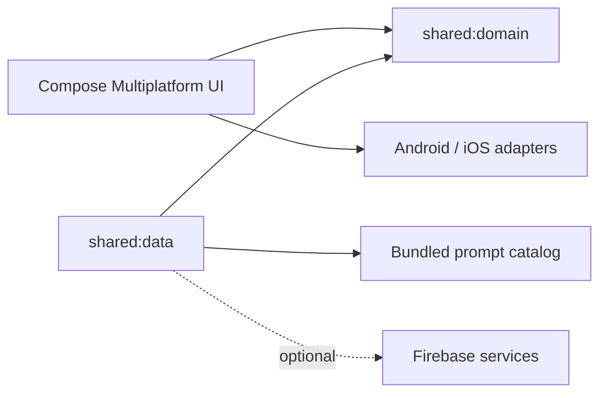

# Impostor

Mobilna gra towarzyska typu pass-and-play z ukrytymi rolami. Jeden telefon krąży między graczami: agenci poznają tajne hasło, a impostor próbuje je odgadnąć, nie zdradzając swojej roli.

## Rozgrywka

1. Dodaj co najmniej trzech graczy.
2. Wybierz jedną lub więcej kategorii oraz liczbę impostorów.
3. Każda osoba przytrzymuje ekran, aby odsłonić swoją rolę, a następnie oddaje telefon kolejnej osobie.
4. Agenci widzą wspólne hasło. Impostor otrzymuje tylko oznaczenie roli lub opcjonalną wskazówkę.
5. Po ujawnieniu wszystkich ról aplikacja wskazuje osobę rozpoczynającą dyskusję.
6. Gracze zadają pytania, próbują odnaleźć impostora, a impostor stara się rozpoznać hasło.

Gra działa lokalnie i nie wymaga konta ani połączenia z siecią do podstawowej rozgrywki. Zawiera katalog haseł, trzy darmowe rozgrywki oraz opcjonalną subskrypcję odblokowującą pełny katalog.

## Najważniejsze funkcje

- Lokalna rozgrywka dla 3 lub większej liczby osób.
- Losowanie hasła, ról i osoby rozpoczynającej.
- Wybór kategorii oraz liczby impostorów.
- Efekt lodowego odsłaniania roli wymagający przytrzymania ekranu.
- Lokalne zapamiętywanie nazw graczy i ostatnio wybranych kategorii.
- Przypomnienie o grze oraz opcjonalny dźwięk i haptyka.
- Android i iOS z jednym współdzielonym rdzeniem w Kotlin Multiplatform.

## Architektura



- `composeApp` zawiera współdzielone ekrany Compose, nawigację stanową i adaptery platformowe dla preferencji, haptyki, dźwięku oraz powiadomień.
- `shared:domain` zawiera czyste reguły gry: walidację ustawień, losowanie ról, wybór hasła i maszynę stanów odsłaniania.
- `shared:data` udostępnia katalog haseł osadzony w aplikacji, lokalny trial oraz adaptery subskrypcji i opcjonalnych usług Firebase.
- Katalog haseł znajduje się w `shared/data/src/commonMain/resources/seed/prompts.json` i jest dostępny offline.

Więcej szczegółów znajduje się w [docs/architecture.md](docs/architecture.md).

## Wymagania

- JDK zgodne z Android Gradle Plugin 8.10.
- Android SDK z API 36 dla Androida.
- Xcode 16+ dla iOS.
- XcodeGen dla wygenerowania hosta iOS z `iosApp/project.yml`.

## Szybki start: Android

```bash
./gradlew :shared:domain:jvmTest :shared:data:jvmTest
./gradlew :composeApp:assembleDebug
```

Pakiet jest gotowy do kompilacji bez `google-services.json`. Plik ten jest potrzebny wyłącznie do włączenia opcjonalnych usług Firebase.

## Szybki start: iOS

```bash
./gradlew :composeApp:assembleComposeAppReleaseXCFramework
cd iosApp
xcodegen generate
open Impostor.xcodeproj
```

Wybierz symulator lub urządzenie w Xcode i uruchom schemat `Impostor`. Szczegóły są w [iosApp/README.md](iosApp/README.md).

## Firebase i płatności

Podstawowa rozgrywka oraz katalog haseł działają offline. Firebase jest opcjonalny i służy do funkcji zdalnych oraz telemetrii. Produkcyjne pliki `google-services.json` i `GoogleService-Info.plist` nie są częścią repozytorium. Instrukcja lokalnej konfiguracji znajduje się w [docs/firebase-setup.md](docs/firebase-setup.md).

Subskrypcja używa identyfikatora produktu `com.impostor.app.premium.monthly`. Aby przetestować zakupy, skonfiguruj odpowiedni produkt w Google Play Console i App Store Connect dla własnych identyfikatorów aplikacji.

## Testy

```bash
./gradlew :shared:domain:jvmTest :shared:data:jvmTest
./gradlew :composeApp:assembleDebug
./gradlew :composeApp:linkDebugFrameworkIosSimulatorArm64
```

Testy domenowe obejmują walidację ustawień, przydzielanie ról, katalog haseł, trial, subskrypcje i reduktor lodowego odsłaniania.

## Prywatność

Gra nie wymaga konta. Nazwy graczy i ustawienia są przechowywane lokalnie na urządzeniu. Nie dodawaj do repozytorium plików Firebase, kluczy, identyfikatorów transakcji ani danych ze środowiska produkcyjnego.

## Licencja

Nie dodano jeszcze licencji. Przed publicznym udostępnieniem wybierz licencję odpowiadającą sposobowi wykorzystania projektu.
