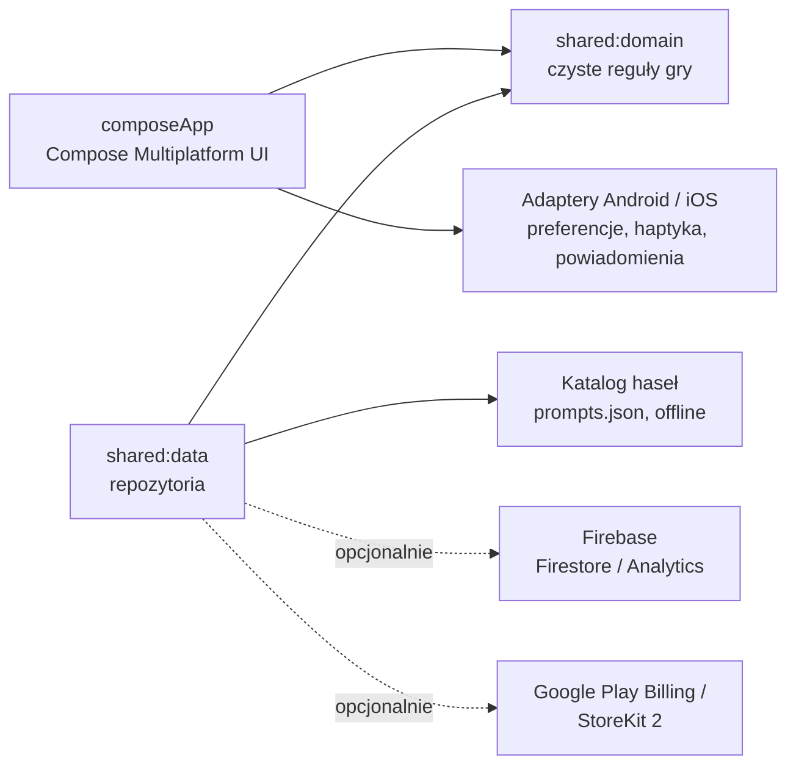

# Impostor

Mobilna gra towarzyska typu pass-and-play z ukrytymi rolami. Jeden telefon krąży między graczami: agenci poznają tajne hasło, a impostor próbuje je odgadnąć, nie zdradzając swojej roli.

Strona wsparcia i polityka prywatności: [jordanrafalm.github.io/impostor](https://jordanrafalm.github.io/impostor/).

## Rozgrywka

1. Dodaj co najmniej trzech graczy.
2. Wybierz jedną lub więcej kategorii oraz liczbę impostorów.
3. Każda osoba przytrzymuje ekran, aby odsłonić swoją rolę, a następnie oddaje telefon kolejnej osobie.
4. Agenci widzą wspólne hasło. Impostor otrzymuje tylko oznaczenie roli lub opcjonalną wskazówkę.
5. Po ujawnieniu wszystkich ról aplikacja wskazuje osobę rozpoczynającą dyskusję.
6. Gracze zadają pytania, próbują odnaleźć impostora, a impostor stara się rozpoznać hasło.

Gra działa lokalnie i nie wymaga konta ani połączenia z siecią do podstawowej rozgrywki. Zawiera katalog haseł, trzy darmowe rozgrywki oraz opcjonalną subskrypcję odblokowującą pełny katalog.

## Najważniejsze funkcje

- Lokalna rozgrywka dla 3 lub większej liczby osób.
- Losowanie hasła, ról i osoby rozpoczynającej.
- Wybór kategorii oraz liczby impostorów.
- Efekt lodowego odsłaniania roli wymagający przytrzymania ekranu.
- Lokalne zapamiętywanie nazw graczy i ostatnio wybranych kategorii.
- Przypomnienie o grze oraz opcjonalny dźwięk i haptyka.
- Android i iOS z jednym współdzielonym rdzeniem w Kotlin Multiplatform.

## Architektura

Projekt to greenfieldowa aplikacja Kotlin Multiplatform (KMP) z w pełni współdzielonym UI w Compose Multiplatform. Kod podzielony jest na trzy moduły Gradle o jednokierunkowej zależności: `composeApp -> shared:domain` oraz `shared:data -> shared:domain`. Moduł domenowy nie zależy od żadnej infrastruktury (brak Firebase, brak Compose, brak API platformowych) — to czysty Kotlin, w pełni testowalny bez emulatora czy symulatora.


```mermaid
flowchart LR
    UI[composeApp<br/>Compose Multiplatform UI] --> Domain[shared:domain<br/>czyste reguły gry]
    Data[shared:data<br/>repozytoria] --> Domain
    UI --> Platform[Adaptery Android / iOS<br/>preferencje, haptyka, powiadomienia]
    Data --> Seed[Katalog haseł<br/>prompts.json, offline]
    Data -. opcjonalnie .-> Firebase[Firebase<br/>Firestore / Analytics]
    Data -. opcjonalnie .-> Store[Google Play Billing /<br/>StoreKit 2]
```

### Moduły

**`shared:domain`** — reguły gry niezależne od platformy:
- `GameDomain.kt` — model `Prompt`/`Category`/`Role`, losowanie przydziału ról i hasła, logika `revealText()` ujawniająca hasło agentom i podpowiedź (lub samo oznaczenie roli) impostorowi.
- `CryoReducer.kt` — maszyna stanów efektu „lodowego” odsłaniania roli (przytrzymanie ekranu).
- `Trial.kt` / `Subscription.kt` — reguły darmowych rozgrywek próbnych i uprawnień premium.
- `RemoteCode.kt`, `PlayerNamesCodec.kt` — walidacja kodów promocyjnych i kodowanie lokalnej listy graczy.

**`shared:data`** — implementacje repozytoriów za interfejsami z domeny, z adapterami `expect`/`actual` dla Android, iOS i JVM (testy):
- `SeedCatalogRepository` — wczytuje i paruje osadzony katalog haseł (`prompts.json`), buduje mapę podpowiedzi.
- `BundledCatalogRepository.*.kt` — platformowe ładowanie zasobu JSON (Android assets, iOS bundle, JVM classpath).
- `TrialRepository`, `SubscriptionRepository`, `SubscriptionPlatform.*.kt` — lokalny licznik prób oraz adaptery zakupów (Google Play Billing na Androidzie, StoreKit 2 przez most Swift na iOS).
- `FirebaseCodeServices.kt`, `RemoteCodeServices.kt`, `FirebasePlatformServices.*.kt` — opcjonalna warstwa zdalnych kodów promocyjnych i telemetrii Firebase; aplikacja działa w pełni offline bez tych plików konfiguracyjnych.

**`composeApp`** — współdzielone ekrany Compose (`App.kt`), nawigacja oparta o stan (bez biblioteki nawigacyjnej), efekt wizualny `IceBackdrop.kt` oraz adaptery platformowe (`*.android.kt` / `*.ios.kt`) dla preferencji graczy/kategorii, haptyki, dźwięku i lokalnych powiadomień (`PartyReminderReceiver` na Androidzie).

### Przepływ danych w rozgrywce

1. `App.kt` pobiera wybrane kategorie i liczbę graczy/impostorów z `CategoryPreferences` / `PlayerPreferences`.
2. `shared:domain` losuje hasło z katalogu (`SeedCatalogRepository` z `shared:data`), przydziela role i kolejność ujawniania.
3. Każdy gracz przytrzymuje ekran (`CryoReducer`) — `Prompt.revealText(role, hintsEnabled)` pokazuje agentom hasło, a impostorowi podpowiedź (jeśli włączona) lub samo oznaczenie roli, nigdy alias/identyczny tekst hasła.
4. Po odsłonięciu wszystkich ról aplikacja wskazuje osobę rozpoczynającą dyskusję.

### Dane gry

Katalog haseł (`shared/data/src/commonMain/resources/seed/prompts.json`) jest jedynym źródłem treści gry, w pełni dostępnym offline. Każdy wpis to para tekst + ręcznie dobrana podpowiedź (semantycznie pośrednia, nigdy pseudonim lub bezpośrednie powiązanie z odpowiedzią). Obecnie obejmuje kilkanaście kategorii, m.in. zwierzęta, miejsca, jedzenie, sport, technologię, kategorię 18+, flirt oraz polskich i zagranicznych celebrytów.

### Firebase i płatności (opcjonalne)

Firebase (Firestore + Analytics) obsługuje wyłącznie zdalne kody promocyjne i telemetrię — nigdy logikę uprawnień. Jedynym źródłem prawdy dla subskrypcji premium jest zweryfikowana transakcja sklepu (Google Play Billing / StoreKit 2); lokalny cache jest tylko optymalizacją dostępności i nie odblokowuje niczego samodzielnie.

Więcej szczegółów architektonicznych, w tym decyzje projektowe, znajduje się w [docs/adr](docs/adr) oraz [docs/architecture.md](docs/architecture.md).

## Wymagania

- JDK zgodne z Android Gradle Plugin 8.10.
- Android SDK z API 36 dla Androida.
- Xcode 16+ dla iOS.
- XcodeGen dla wygenerowania hosta iOS z `iosApp/project.yml`.

## Szybki start: Android

```bash
./gradlew :shared:domain:jvmTest :shared:data:jvmTest
./gradlew :composeApp:assembleDebug
```

Pakiet jest gotowy do kompilacji bez `google-services.json`. Plik ten jest potrzebny wyłącznie do włączenia opcjonalnych usług Firebase.

## Szybki start: iOS

```bash
./gradlew :composeApp:assembleComposeAppReleaseXCFramework
cd iosApp
xcodegen generate
open Impostor.xcodeproj
```

Wybierz symulator lub urządzenie w Xcode i uruchom schemat `Impostor`. Szczegóły są w [iosApp/README.md](iosApp/README.md).

## Firebase i płatności

Podstawowa rozgrywka oraz katalog haseł działają offline. Firebase jest opcjonalny i służy do funkcji zdalnych oraz telemetrii. Produkcyjne pliki `google-services.json` i `GoogleService-Info.plist` nie są częścią repozytorium. Instrukcja lokalnej konfiguracji znajduje się w [docs/firebase-setup.md](docs/firebase-setup.md).

Subskrypcja używa identyfikatora produktu `com.impostor.app.premium.monthly`. Aby przetestować zakupy, skonfiguruj odpowiedni produkt w Google Play Console i App Store Connect dla własnych identyfikatorów aplikacji.

## Testy

```bash
./gradlew :shared:domain:jvmTest :shared:data:jvmTest
./gradlew :composeApp:assembleDebug
./gradlew :composeApp:linkDebugFrameworkIosSimulatorArm64
```

Testy domenowe obejmują walidację ustawień, przydzielanie ról, katalog haseł, trial, subskrypcje i reduktor lodowego odsłaniania.

## Prywatność

Gra nie wymaga konta. Nazwy graczy i ustawienia są przechowywane lokalnie na urządzeniu. Nie dodawaj do repozytorium plików Firebase, kluczy, identyfikatorów transakcji ani danych ze środowiska produkcyjnego.

## Licencja

Nie dodano jeszcze licencji. Przed publicznym udostępnieniem wybierz licencję odpowiadającą sposobowi wykorzystania projektu.
