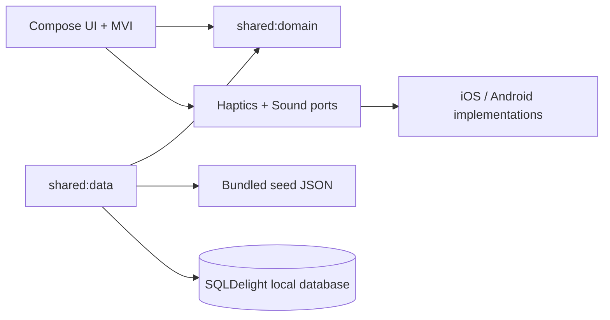
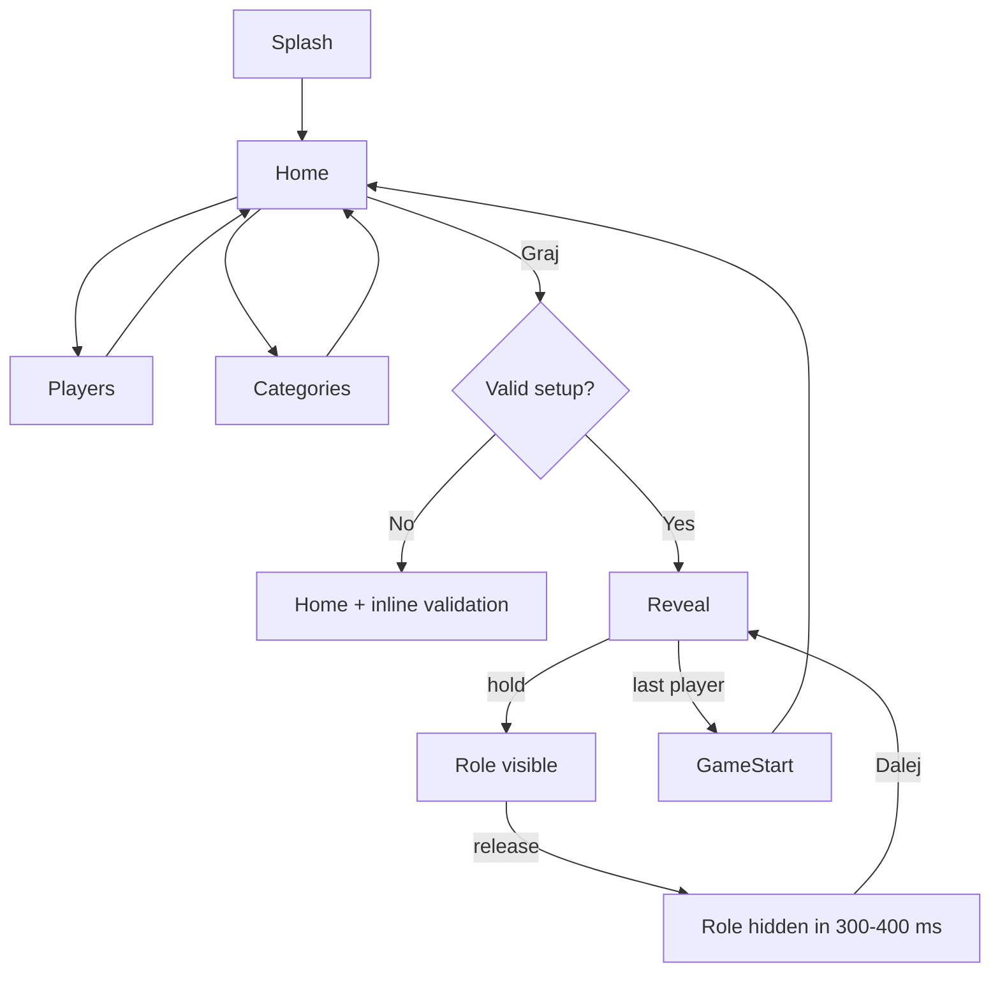

# ADR-0001: Offline Pass & Play architecture

## Status

Accepted for planning. The visual system remains governed by the Figma MCP export when it is available.

## Context

Impostor is a local, pass-and-play party game with hidden identities. One phone is passed between players. There is no backend, account system, network dependency, or cross-device synchronization. The app must keep the active round deterministic after it starts and must hide the previous player's role immediately when the device is released.

The authenticated Figma MCP file `impostor` is the visual source of truth. The approved frames are `2:8` (home), `2:65` (players), `2:126` (categories), `2:184` (promo-code modal), and `2:219` (role reveal). The current frames are 402 x 874 mobile surfaces with a 36dp outer radius, edge-to-edge dark radial background (`#050914` to `#162846`), Outfit display typography, Inter body typography, cyan accent `#00F0FF`, and translucent glass surfaces. Exact component geometry, exported icons, and screen copy come from those Figma nodes; the earlier React prototype is only a behavioral reference.

The repository memories describe a KMP + Compose Multiplatform baseline with MVI, state-based navigation, shared-first code, and data hidden behind repositories. This ADR specializes that baseline for a fully local game and explicitly removes Firebase, remote sync, authentication, analytics, and cloud leaderboards from the MVP.

## Decision

Build a small KMP application with three modules:

```text
:composeApp
  commonMain: Compose screens, navigation, MVI ViewModels, theme, Cryo renderer
  androidMain: vibration, audio output, platform lifecycle glue
  iosMain: haptics, audio output, platform lifecycle glue

:shared:domain
  pure Kotlin models, rules, use cases, repository contracts

:shared:data
  bundled seed reader, SQLDelight local store, repository implementations, mappers
```

Dependency direction is one-way:



The domain has no Compose, SQLDelight, Android, iOS, Firebase, or audio dependencies. Platform capabilities are injected through small interfaces owned by the presentation/app boundary:

```kotlin
interface Haptics {
    fun thermalPulse()
    fun flashFreeze()
}

interface SoundPlayer {
    fun startThermalLoop()
    fun stopThermalLoop()
    fun playFreezeCrack()
}
```

Unsupported haptics or audio are no-ops. The visual role security behavior remains intact.

## Domain model

Use immutable, serializable value models. IDs are stable strings so a future seed replacement cannot change an in-progress round.

```kotlin
data class Category(
    val id: String,
    val displayName: String,
    val iconKey: String,
    val isUnlocked: Boolean = true,
)

data class Prompt(
    val id: String,
    val categoryId: String,
    val text: String,
)

enum class Role { AGENT, IMPOSTOR }

data class Player(
    val id: String,
    val displayName: String,
)

data class Assignment(
    val playerId: String,
    val role: Role,
)

data class GameSetup(
    val players: List<Player>,
    val selectedCategoryIds: Set<String>,
    val impostorCount: Int,
)

data class GameSession(
    val sessionId: String,
    val prompt: Prompt,
    val assignments: List<Assignment>,
    val starterPlayerId: String,
    val revealIndex: Int = 0,
)
```

`GameSession` is created once by `StartGameUseCase`. It contains the selected prompt, assignments, and starter. No later seed reload or random call may mutate it. Randomness is supplied as an injected `RandomSource` and is seeded in tests.

Required use cases:

- `LoadCatalogUseCase`: returns categories and prompts from the local repository.
- `ValidateGameSetupUseCase`: requires at least 3 players, one selected category, and `1 <= impostorCount < playerCount`.
- `StartGameUseCase`: chooses one prompt, selects distinct impostor indexes, assigns the remaining players as agents, and chooses the starter.
- `RevealNextPlayerUseCase`: advances only after the current reveal has been seen.
- `FinishRevealUseCase`: transitions to the game-start screen after the last player.

## Local data and seed strategy

The source of truth for shipped content is `shared/data/src/commonMain/resources/seed/prompts.json`, initially authored and validated at `docs/seed/prompts.json`. The file declares exactly 10 `activeCategoryIds`, each with 100 unique prompts. It may also contain explicitly non-active future categories; the importer must load only `activeCategoryIds` for MVP. The stable record shape is:

```json
{
  "schemaVersion": 1,
  "categories": [
    {
      "id": "animals",
      "name": "Zwierzęta",
      "iconKey": "paw",
      "prompts": [
        { "id": "animals-001", "text": "Pingwin" }
      ]
    }
  ]
}
```

At first launch, `SeedCatalogDataSource` parses the bundled JSON and imports only `activeCategoryIds` into SQLDelight in one transaction. Subsequent launches read SQLDelight only. This gives a small, inspectable source file, fast indexed reads, and a stable upgrade path if the seed grows. The import is idempotent and keyed by `schemaVersion`; an app update may replace seed content without touching the active session.

Recommended SQLDelight tables:

```text
CategoryEntity(id TEXT PRIMARY KEY, name TEXT, iconKey TEXT, sortOrder INTEGER, enabled INTEGER)
PromptEntity(id TEXT PRIMARY KEY, categoryId TEXT, text TEXT, enabled INTEGER)
CatalogMeta(key TEXT PRIMARY KEY, value TEXT NOT NULL)
```

Queries should include `selectEnabledCategories`, `selectEnabledPromptsByCategoryIds`, `replaceCatalog`, and `getMeta`. The repository exposes domain models only. Do not use Room in this project: SQLDelight fits the existing KMP memory and gives generated, typed queries on Android and iOS.

## Navigation flow

Use the existing state-based navigation pattern (`Route` sealed interface plus `AnimatedContent`). Do not add a navigation library for MVP.



Routes:

- `Splash`: initializes the local catalog and restores no game state.
- `Home`: player count, category entry, impostor stepper, start action, and optional code modal if premium unlock is retained.
- `Players`: add, remove, and rename players; enforce unique non-empty names at submit time.
- `Categories`: select one or more unlocked categories; locked categories are visual-only until a local unlock code feature is defined.
- `Reveal(sessionId, playerIndex)`: owns the Cryo state machine and never displays the next player's data before reset.
- `GameStart(sessionId)`: shows the starter and ends/returns to Home.

Navigation effects are one-shot (`Navigate(Route)`, `ShowError`) and are emitted by ViewModels. Composables render immutable state and emit intents.

## Cryo reveal design

The Reveal screen is an explicit state machine, not a Boolean overlay:

```text
Idle(revealProgress = 0)
  -- pointer down --> Melting(progress 0..1, contactPoint)
Melting(progress >= revealThreshold) -- show role --> Revealed
Melting -- pointer up/cancel --> FlashFreezing(progress 1..0)
Revealed -- pointer up/cancel --> FlashFreezing(progress 1..0)
FlashFreezing(duration 380 ms) --> Idle(progress = 0)
```

The reducer receives `PointerDown(position)`, `PointerMoved(position)`, `PointerUp`, `PointerCancel`, and `Frame(elapsedMillis)`. The timer/animation driver is outside the pure reducer. A pointer cancel must follow the same path as release so an interrupted touch never leaves the role visible.

### Idle / deep freeze

- Render role and prompt in the core layer, but cover them with an opaque frost layer.
- Use a `RuntimeShader`/AGSL implementation on Android where available and a shared Compose fallback based on `drawWithCache`, radial gradients, blur, and layered crystal paths.
- Keep the shader behind a `CryoSurface` interface so iOS can use a Metal-backed implementation later without changing state logic.
- Shader uniforms: `revealProgress`, `contactX`, `contactY`, `frostNoiseSeed`, `crystalDensity`, and `freezeProgress`.
- Accessibility fallback: the role remains fully hidden until the progress threshold; reduced motion changes timing and removes noise, never the security mask.

### Thermal overclock / hold-to-melt

- Use `Modifier.pointerInput` with `awaitEachGesture` and consume the pointer stream.
- Record the initial contact point in normalized coordinates. The design reference currently uses the center; supporting the actual contact point makes the behavior robust to small finger offsets.
- Animate progress toward `1f` only while the pointer remains down. Suggested full hold duration: 1000 ms; role becomes readable at `0.6f`.
- Drive an amber-to-neon-blue radial glow from the contact point, reduce blur and displacement as progress rises, and reveal the core with the inverse radial mask.
- Start a short thermal haptic pulse and the hiss loop on pointer down. Stop the loop on release or cancel.

### Cryo flash-freeze / release-to-hide

- On every release/cancel, immediately set the semantic state to `FlashFreezing`; do not wait for the visual animation before disabling `Dalej`.
- Animate `freezeProgress` from `0f` to `1f` in 380 ms. The crystal mask grows from the edge toward the center and text alpha is forced to zero before the final frame.
- Trigger a short haptic impact and ice-crack sound, then reset all reveal state to `Idle`.
- On a `playerIndex` change, clear shader uniforms, audio handles, and press state before composing the next player's screen.
- Never log role, prompt, or player assignment to analytics or crash reports.

The visual Figma frame controls exact dimensions, corner radii, colors, typography, and copy. The security invariants above are non-negotiable even if visual polish changes.

## Platform effects

Implement `Haptics` and `SoundPlayer` in `composeApp/platform`. Android uses `VibratorManager` and an audio player with bundled short assets. iOS uses `UIImpactFeedbackGenerator`/`UINotificationFeedbackGenerator` and `AVAudioPlayer`. Both platforms must respect local settings (`hapticsEnabled`, `soundEnabled`) and fail silently if the capability is unavailable.

Do not make role state dependent on audio initialization. Visual hiding is the security boundary; haptics and sound are enhancement effects.

## Testing and acceptance criteria

### Domain tests

- invalid setup rejects fewer than 3 players, no category, and all-player impostor assignment;
- start game creates exactly one prompt and the requested number of distinct impostors;
- seeded random source produces repeatable assignments;
- reveal cannot advance before the current player reaches the seen threshold;
- last reveal transitions to `GameStart`.

### Cryo reducer tests

- `Idle + PointerDown` starts `Melting` and records contact point;
- `Melting + PointerUp` immediately enters `FlashFreezing` and clears semantic visibility;
- `PointerCancel` behaves exactly like `PointerUp`;
- `FlashFreezing` completes in the configured 300-400 ms interval;
- changing player index resets to `Idle` with no stale role visibility.

### Manual device checks

- Android and iOS: release by lifting, sliding out, system gesture, and app backgrounding all hide the role;
- device rotation/backgrounding does not expose a previous role in the next player state;
- TalkBack/VoiceOver does not announce the hidden role before the reveal threshold;
- reduced-motion mode still preserves the mask and release-to-hide behavior;
- 200% text size does not clip player names or role text;
- Figma visual comparison is performed once the Figma MCP export is available.

## Consequences

Positive:

- The game is fully usable in airplane mode and has no privacy-sensitive network surface.
- Session determinism is explicit and testable.
- SQLDelight supports fast local queries while keeping the seed file reviewable.
- The Cryo effect can evolve from Compose fallback to platform shader without changing game rules.

Costs and trade-offs:

- A local database is more setup than reading JSON on every launch, but avoids repeated parsing and provides a clean content migration path.
- Shader parity between Android and iOS needs a fallback renderer and device testing.
- A pass-and-play game cannot recover an active session across process death unless session persistence is deliberately added. MVP should discard the session on process death for privacy; never persist role assignments by default.
- The existing prototype includes premium category/code affordances. Since there is no backend, unlock state must remain local and should be specified separately before implementation.

## Delivery phases

1. **Foundation:** KMP modules, domain models, deterministic random source, state-based routes, platform ports.
2. **Catalog:** seed JSON, SQLDelight schema/import, repository and validation tests.
3. **Setup flow:** Home, Players, Categories, setup reducer, and start-game use case.
4. **Reveal:** Cryo state machine, Compose fallback renderer, haptics/audio ports, reducer tests.
5. **Polish:** shader/Metal/AGSL optimization, reduced-motion/accessibility, visual comparison against Figma, device checks.

## Open follow-ups

- Add the Figma MCP export path and frame/token identifiers to the relevant screen KDocs once supplied.
- Decide whether local category unlock codes are in MVP; no security-sensitive entitlement should be implied without a product rule.
- Choose bundled audio asset format and confirm licensing before adding sound files.
