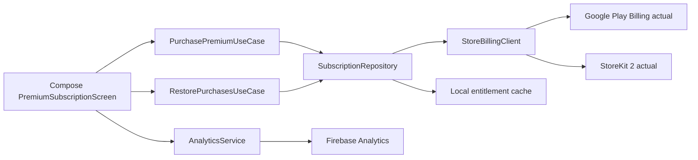
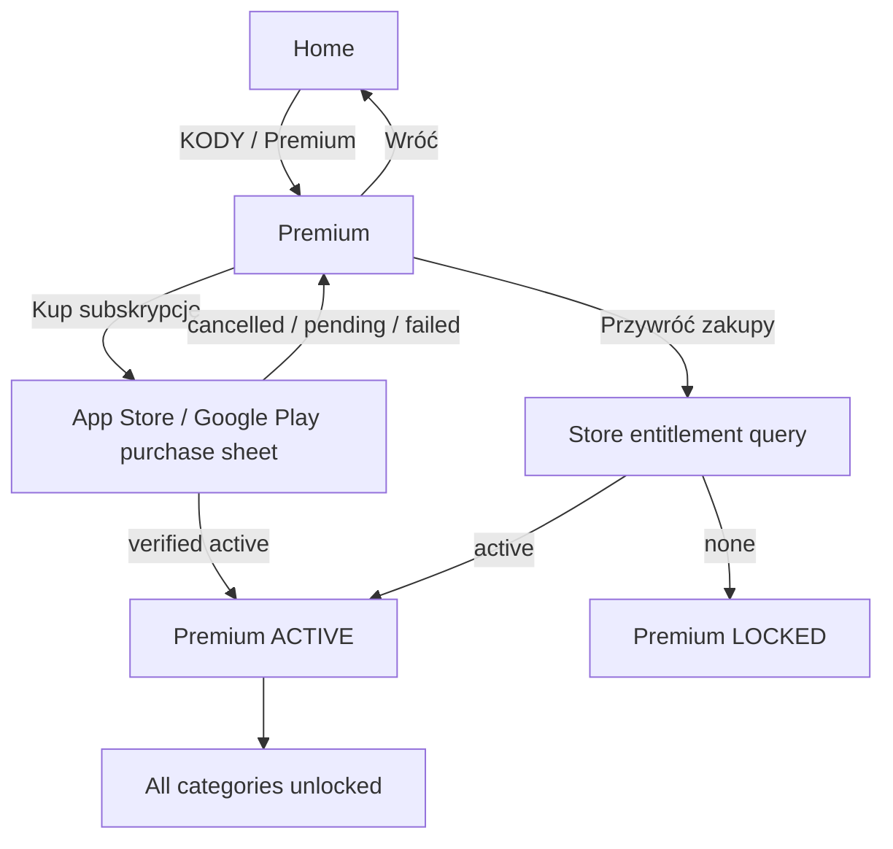

# ADR-0003: Store subscription entitlement migration

## Status

Accepted. Shared domain/data and Compose runtime migration implemented; store SDK adapters remain a platform integration gate.

## Context

The current `KODY` flow validates promo codes from Firestore and unlocks categories locally. The requested product change is to replace that flow with an official subscription purchase from the Apple App Store and Google Play. After a successful purchase, all premium categories must unlock. Users must be able to restore an existing subscription after reinstalling the app or changing devices where the store account is available.

The application remains offline-first for gameplay. Firebase must remain only an analytics provider. Firestore promo codes are no longer part of the premium entitlement path and should be removed from the user-facing navigation after the migration.

The repository is KMP + Compose Multiplatform with shared domain/data boundaries and platform-specific Android/iOS source sets. The current Android application ID and iOS bundle ID are both `com.impostor.app`.

## Decision

Replace the `KODY` destination with a shared `PremiumSubscriptionScreen`. The screen renders a store-backed subscription offer and exposes:

- `Subscribe`: starts the platform purchase flow;
- `Restore purchases`: queries current store entitlements;
- `Manage subscription`: opens the platform subscription-management page;
- current entitlement state: `Locked`, `Purchasing`, `Active`, `Expired`, `Restoring`, or `Unavailable`.

The domain does not know StoreKit, Google Play Billing, Firebase, product objects, receipts, or platform UI. It owns contracts and entitlement decisions only.

## Product and store configuration

Use one subscription product with platform-specific IDs:

```text
Apple product ID: com.impostor.app.premium.monthly
Google product ID: com.impostor.app.premium.monthly
Entitlement key: premium_all_categories
Subscription period: monthly
```

The product must be configured separately in each store:

### App Store Connect

1. Create an auto-renewable subscription group named `Impostor Premium`.
2. Add product `com.impostor.app.premium.monthly`.
3. Configure localized name, description, price, tax category, and availability.
4. Add a sandbox tester account.
5. Submit the product with the app version when App Store Connect requires review.

### Google Play Console

1. Create subscription `com.impostor.app.premium.monthly`.
2. Create a base plan with monthly billing and the desired regional pricing.
3. Create an offer only if introductory pricing is required; the app must treat the base plan and offer as the same entitlement.
4. Add license testers.
5. Ensure the package name is `com.impostor.app` and publish the subscription to an internal testing track before production.

The exact price, trial, introductory offer, and cancellation policy are product decisions and must not be hardcoded in shared UI. The store-provided localized product metadata is the display source of truth.

## Architecture



Recommended module placement:

```text
shared:domain
  SubscriptionProduct
  Entitlement
  SubscriptionState
  SubscriptionRepository
  PurchasePremiumUseCase
  RestorePurchasesUseCase

shared:data
  SubscriptionRepositoryImpl
  LocalEntitlementStore contract/implementation

composeApp/commonMain
  PremiumSubscriptionScreen
  subscription state holder
  route/effects

composeApp/androidMain
  GooglePlayBillingClient

composeApp/iosMain
  StoreKit2BillingClient
```

Firebase imports stay behind the existing analytics adapter. No Firebase or Firestore call may determine whether premium is active.

## Domain model

```kotlin
enum class SubscriptionState {
    LOCKED,
    PURCHASING,
    ACTIVE,
    EXPIRED,
    RESTORING,
    UNAVAILABLE,
}

data class SubscriptionProduct(
    val productId: String,
    val title: String,
    val formattedPrice: String,
    val periodLabel: String,
)

data class Entitlement(
    val key: String,
    val state: SubscriptionState,
    val expiresAtMillis: Long?,
    val source: EntitlementSource,
)

enum class EntitlementSource {
    STORE,
    LOCAL_CACHE,
}

interface SubscriptionRepository {
    val state: Flow<Entitlement>
    suspend fun loadProduct(): Result<SubscriptionProduct>
    suspend fun purchase(): Result<Entitlement>
    suspend fun restorePurchases(): Result<Entitlement>
    suspend fun openManageSubscriptions(): Result<Unit>
}
```

The entitlement is active only when the platform billing SDK reports an active, verified purchase. `unlockAllCategories` is then derived from `Entitlement.state == ACTIVE`; no category IDs are stored in Firestore or in a promo-code document.

## Platform purchase behavior

### Android: Google Play Billing

- Use Google Play Billing through a small `GooglePlayBillingClient` adapter.
- Connect to `BillingClient` before loading the product.
- Query `ProductDetails` for `com.impostor.app.premium.monthly`.
- Launch the billing flow with the selected offer token.
- Process `PurchasesUpdatedListener` and query existing purchases on every app start.
- Grant entitlement only for `PURCHASED` purchases after acknowledging them.
- Do not grant entitlement for `PENDING` until a later query reports `PURCHASED`.
- Use `BillingClient.queryPurchasesAsync` for restore; do not rely only on a local flag.
- Open subscription management with the Play subscriptions URL for `com.impostor.app`.

### iOS: StoreKit 2

- Use `Product.products(for:)` for `com.impostor.app.premium.monthly`.
- Start purchase with `product.purchase()`.
- Handle `.success(.verified(transaction))` only; unverified transactions do not activate premium.
- Finish verified transactions after persisting the entitlement.
- Observe `Transaction.updates` for renewals, revocations, refunds, and billing changes.
- Restore with `AppStore.sync()` after explicit user action and re-read `Transaction.currentEntitlements`.
- Use `manageSubscriptions` or the platform subscription URL for management.

The shared state holder must react to renewal/revocation updates while the app is running.

## Local entitlement cache

Persist only the minimum non-sensitive state:

```text
premium_entitled: Boolean
premium_expires_at_millis: Long?
premium_last_verified_at_millis: Long
```

The cache is an availability optimization, not a permanent grant:

- On cold start, show cached `ACTIVE` state immediately if it has not passed its cached expiration.
- Query the store in the background and replace the cache with the latest verified state.
- If the cached expiration has passed, show `EXPIRED` until the store confirms an active entitlement.
- Never use Firebase or a locally typed code to restore premium.
- Do not persist receipts, purchase tokens, transaction payloads, or user identifiers in shared preferences.

Without a backend, cross-device entitlement verification is delegated to Apple/Google store accounts and their SDKs. A future backend can validate receipts/server notifications, but it is not required for this migration.

## Navigation migration



Required UI behavior:

- Rename visible `KODY` copy to `PREMIUM` or `SUBSKRYPCJA`; do not suggest that codes still exist.
- Keep the existing Figma glassmorphism and edge-to-edge shell, but add store product title, localized price, billing period, restore, and manage actions.
- Disable purchase while a purchase or restore is pending.
- Show a clear error for unavailable store, cancelled purchase, pending purchase, and failed restore.
- After `ACTIVE`, update the shared category entitlement state and select/unlock all active categories.
- On app start, restore/query store entitlement before allowing premium-only categories to remain unlocked indefinitely.

## Firebase Analytics migration

Retain Firebase Analytics only for privacy-safe product events:

```text
premium_screen_opened
subscription_product_loaded
subscription_purchase_started
subscription_purchase_result { result: success|cancelled|pending|failed }
subscription_restore_result { result: active|none|failed }
premium_entitlement_changed { state: active|expired|revoked|locked }
```

Never log product receipt, transaction ID, purchase token, email, player name, prompt, promo code, or raw store error payload. Remove `codes_opened` and `code_validated` once the promo-code UI is removed, or retain them only during a short migration release if historical analytics continuity is required.

## Firestore and promo-code migration

- Stop reading `promoCodes` from the app after the subscription release.
- Keep existing Firestore documents for operational rollback for one release, but they must not grant entitlement in the new build.
- After the migration is stable, delete or lock the `promoCodes` collection and remove its public-read rule.
- Firebase Analytics remains enabled; Firestore is no longer required by the client.

## Testing plan

### Domain tests

- active store entitlement unlocks all active category IDs;
- expired, revoked, pending, and unverified states do not unlock categories;
- cached active entitlement is shown immediately and replaced by the store result;
- restore with no purchase leaves categories locked;
- product loading and purchase failures map to stable domain errors.

### Platform adapter tests

- Google Play: purchased, pending, cancelled, already-owned, billing-unavailable;
- StoreKit: verified, unverified, revoked, expired, restored, pending;
- transaction update stream changes entitlement state;
- purchase acknowledgement/transaction finishing is called exactly once.

### Manual store tests

- Google Play internal testing track with license tester;
- App Store Sandbox tester;
- fresh install, reinstall, restore, renewal, cancellation, refund/revocation;
- airplane mode with valid cached entitlement;
- store unavailable while starting a free game;
- 200% text size and localized store price on the subscription screen.

## Delivery phases

1. **Billing contract:** add domain models, repository, use cases, entitlement cache, and fake tests.
2. **Android billing:** integrate Google Play Billing, product configuration, purchase/restore flows, and emulator/device tests.
3. **iOS billing:** integrate StoreKit 2, App Store Connect product, restore/update streams, and Sandbox tests.
4. **UI migration:** replace `KODY` route and screen with the Figma-aligned subscription screen; wire all-category entitlement.
5. **Analytics migration:** add subscription events, remove code events, and verify Firebase DebugView.
6. **Decommission codes:** stop client Firestore reads, lock/delete public promo-code rules, and update documentation.

## Acceptance criteria

- A verified monthly subscription from either store unlocks all 10 active categories.
- Restore purchases works after reinstall when the store account owns the subscription.
- Expired, revoked, pending, cancelled, and unverified purchases do not grant access.
- Gameplay remains usable offline and free gameplay never depends on Firebase or store availability.
- Firebase receives only the documented analytics events and no purchase-sensitive data.
- Android package and iOS bundle remain `com.impostor.app`.

## Implementation notes (2026-09-13)

- `shared:domain` owns subscription models, stable errors, repository contract, purchase/restore use cases, and the store-only `unlocksAllCategories` decision.
- `shared:data` owns repository orchestration and a minimal entitlement cache. It stores only entitlement boolean, expiration, and last verified timestamp. Cached ACTIVE is displayed as `LOCAL_CACHE` and never unlocks categories until a store result verifies it.
- The promo-code repository is no longer constructed by the app and the user-facing route is now `PREMIUM`. Existing `promoCodes` documents are not read by this runtime.
- Analytics includes only the documented premium/subscription events and allowlisted result/state values. Receipts, transactions, tokens, users, and raw errors are not logged.
- Platform source sets expose compile-safe billing seams with an unavailable fallback. Google Play Billing and StoreKit 2 must be wired at these seams before release; the fallback never fabricates a purchase or entitlement.
- Revoked, expired, pending, cancelled, unavailable, unverified, and restore-with-no-entitlement states keep premium categories locked.