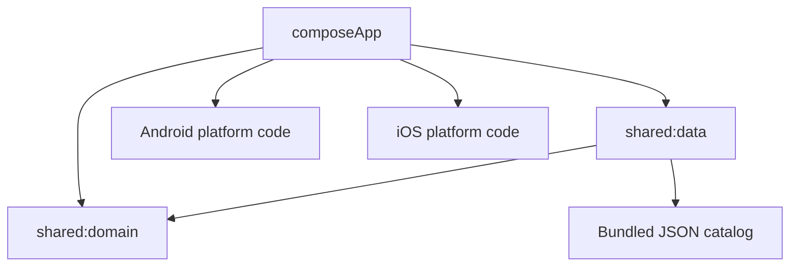
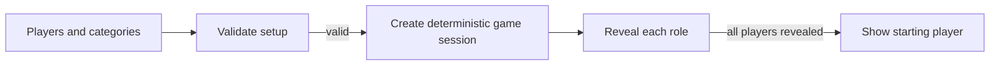

# Architektura

## Moduły

| Moduł | Odpowiedzialność |
|---|---|
| `composeApp` | Współdzielony interfejs Compose, przepływy ekranów i adaptery platformowe. |
| `shared:domain` | Reguły gry, modele, przypadki użycia i kontrakty. Nie zależy od UI, platform ani usług zewnętrznych. |
| `shared:data` | Katalog haseł, lokalny trial, subskrypcje oraz adaptery opcjonalnych usług zewnętrznych. |
| `iosApp` | Host SwiftUI, zasoby i definicja projektu XcodeGen. |

## Zależności

Kierunek zależności jest jednokierunkowy: UI korzysta z domeny, a implementacje danych realizują kontrakty domenowe. Kod domenowy nie importuje Compose, Androida, iOS ani Firebase.

## Przepływ gry

`ValidateGameSetupUseCase` sprawdza liczbę graczy, kategorie, liczbę impostorów i unikalność nazw. `StartGameUseCase` wybiera hasło, rozdziela role i losuje osobę rozpoczynającą. Po rozpoczęciu sesja ma niezmienne przypisania, dzięki czemu kolejne ekrany nie zmieniają wyniku losowania.

## Odsłanianie roli

`CryoReducer` jest czystą maszyną stanów sterującą efektem lodu:

1. `Idle` — rola jest ukryta.
2. `Melting` — przytrzymanie ekranu odsłania rolę.
3. `Revealed` — rola jest czytelna.
4. `FlashFreezing` — zwolnienie ekranu szybko ukrywa dane przed kolejnym graczem.

Logika jest testowana bez Compose i bez czasu rzeczywistego przez przekazywanie zdarzeń ramki oraz dotyku.

## Dane i prywatność

Katalog jest pakowany razem z aplikacją jako JSON, więc gra działa offline. Nazwy graczy i wybrane kategorie są przechowywane lokalnie. Firebase nie jest częścią rdzenia rozgrywki; po skonfigurowaniu może obsługiwać funkcje opcjonalne. Żaden plik konfiguracji produkcyjnej nie jest śledzony przez Git.
